# REST Chess solver

## Project information

* Python 3.10
* Black (formatting)
* Flake8 (linter)
* Flask 1.0+
* Dozwolone jest używanie zewnętrznych bibliotek - chess

## The chess library was used to conceal the proverbial rediscovery of the wheel

Another reason I didn't reinvent the game was because ** I can't play chess **

## Remarks!

[GET] `/api/v1/{chess-figure}/{current-field}` (displays a list of possible moves)
this way of validating possible moves is not good for several reasons:

1. what if the pawn is not on the chosen field
1. since we have a board created, why choose a pawn if the pawn belongs to the field
The first field has one pawn on it at a time and it is known which pawn is on it

## This method has been replaced with the following

it can be GET or POST
        [GET/POST] `/api/v1/check/{current-field}`

method of moving pawns

        [GET/POST] `/api/v1/{current-field}/{destination-field}`

## TUTORIAL

### WINDOWS

make sure you have the necessary modules
in the path where app.py is, execute the following command

    `pip install -r requirements.txt`
if you have all modules, you can run the application

    `python app.py [port]`
#####example:
    `python app.py 8080`
**or**
    
    `python app.py`

when we do not specify the port, the default will be ** 5000 **

## valid checkerboard

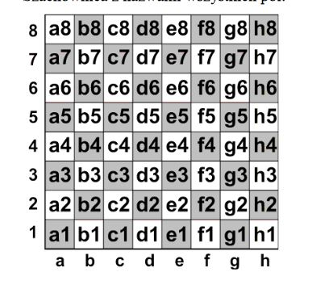]

## arranging the pawns

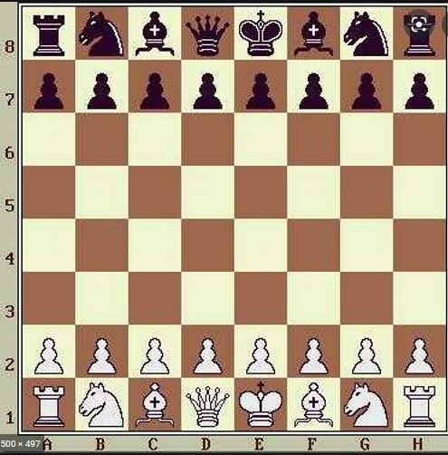]

## how to play?

launching the application starts the game, the rules are the same as in chess
the easiest way to start the game is in the browser

## 1. get started

server response after the command:

     `python app.py 8080`
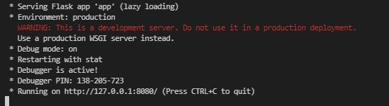]

## 2. open a browser

## 3. check where you can move the pawn from position b2

    localhost:8080/api/v1/check/b2

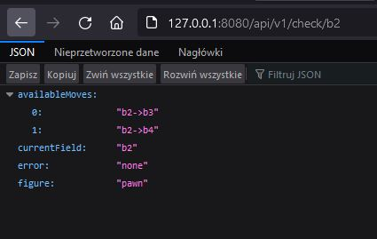]

as you can see, we have two options, we can use it ** from b2 to b3 or b4 **

## 4. Use this pawn to move to the b4 field

    `localhost:8080/api/v1/b2/b4`

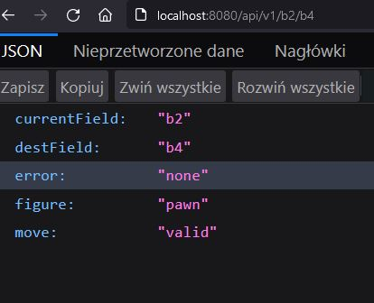]

you managed to move, the chessboard preview was also displayed on the console

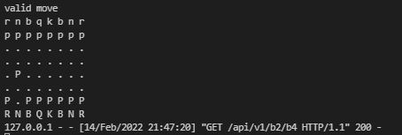]

let's try to move the same pawn a second time now, which is not allowed

    localhost:8080/api/v1/b4/b5

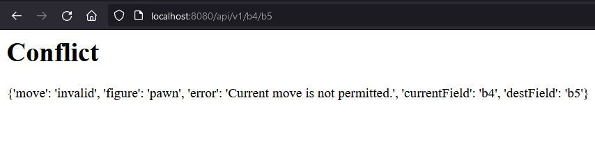]

traffic not allowed and response 409

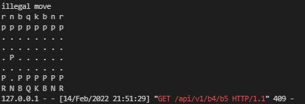]

## 5. move the second player with a pawn with f7

** let's check what options we have **
    
    `localhost:8080/api/v1/check/f7`

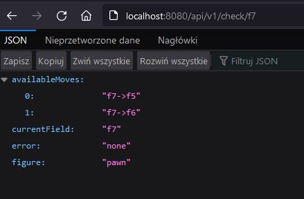]

**> move it to f6 **

`localhost:8080/api/v1/f7/f6`

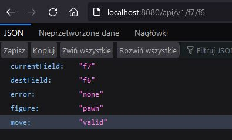]

** and a preview of the game status in the console **

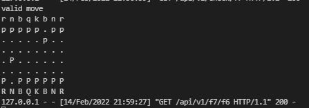]

## what will happen if we choose a field with no pawn?

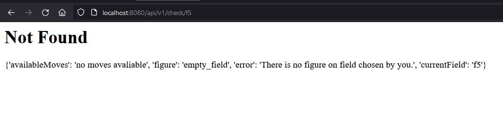]

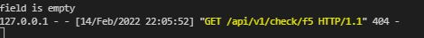]

## contact
**natanlisowski@gmail.com**
